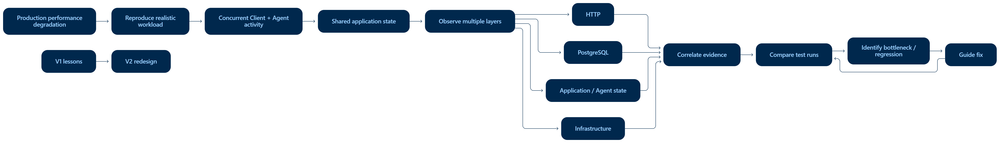
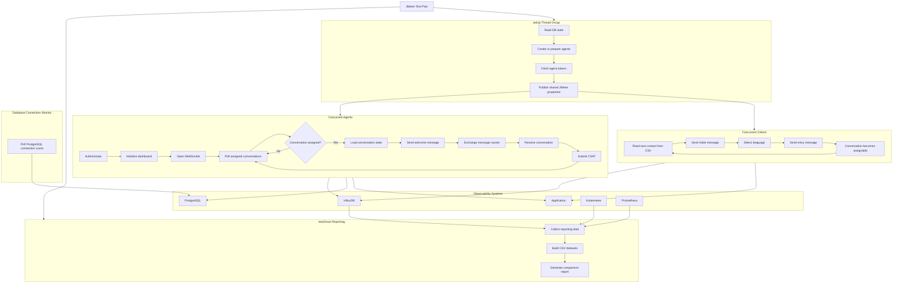

# JMeter Performance Testing Framework - Development Case Study

> A JMeter 5.5 performance testing framework built for a real production investigation:
>
> stateful workload modelling, concurrent Client and Agent actors, custom Groovy orchestration, observability, and automated comparison-ready reporting.

This repository is my first-generation performance testing framework.

It is intentionally presented as a case study, not as a clean-room template.



The original solution was **created under production incident pressure**, where the most important requirement was to produce useful **performance evidence quickly** enough to guide investigation and fixes.

The later lessons from this JMeter solution became the basis for the second-generation [k6 Performance Testing Framework](https://github.com/Netheria/k6-Performance-Testing-Framework).

## What This Project Demonstrates

- Stateful business workload modelling, not isolated endpoint benchmarking
- Multiple concurrent JMeter Thread Groups
- Client and Agent virtual users interacting through shared application state
- Cross-Thread-Group setup using global JMeter properties
- PostgreSQL access for setup and runtime monitoring
- InfluxDB metric export through standard and custom listeners
- Kubernetes and Prometheus integration during report generation
- Heavy JSR223/Groovy orchestration inside a JMeter test plan
- Automated CSV dataset generation and HTML comparison report support
- Engineering trade-offs made under urgent delivery constraints

<p align="center">
    <b>But most importantly, the development process and decisions made!</b>
</p>

<p align="center">
    <b>Therefore, I highly recommend reading the whole step-by-step story in </b><a href="docs/engineering-story.md"><b>docs/engineering-story.md.</b></a>
</p>

## Repository Map

| Path | Purpose |
|---|---|
| `flows/performance/testapp.performance.conversationload.jmx` | Main JMeter performance test plan |
| `flows/performance/conversationload_scripts/` | Groovy scripts used by listeners and teardown reporting |
| `flows/performance/query_list.xml` | InfluxDB query definitions for generated datasets |
| `flows/performance/Transactions.txt` | Mapping between samplers and logical transaction groups |
| `resources/` | Sanitized sample data and reference resource files |
| `results/test2`, `results/test3` | **Proof-of-work result datasets** from successful executions |
| `docs/` | Architecture, message flow, reporting, observability, and execution notes |

## Engineering Story

This project was not designed in a calm greenfield phase.

It started because a customer-support platform had serious production **performance degradation on a major client environment**.

Production was too sensitive for deep experimentation, while test and development environments without load could not reproduce the problem.

The framework grew around immediate investigation needs:

1. Reproduce realistic customer-support workload.
2. Simulate Clients and Agents concurrently.
3. Correlate HTTP timings with database, infrastructure, and business metrics.
4. Produce comparable results after each build or infrastructure change.
5. Preserve lessons for a cleaner second-generation design.

The full story is documented in [docs/engineering-story.md](docs/engineering-story.md).

## Architecture at a Glance

The test plan uses one setup phase, three concurrent regular Thread Groups, and one teardown reporting phase.



Read the full architecture in [docs/architecture.md](docs/architecture.md).

## Workload Model

The workload models two user types that affect the same business state.

### Client

Client threads act as conversation generators.

A Client reads contact data from CSV, sends the entry sequence through the webhook/bot flow, and creates conversations that become available for support agents.

```text
    -> CSV contact data
    -> initial message
    -> language selection
    -> entry message
    -> conversation becomes assignable
    -> next contact
```

### Agent

Agent threads behave as active support agents.

They authenticate, initialize the dashboard, open a WebSocket connection, poll for assigned conversations, process each conversation, resolve it, submit CSAT, and return to polling.

```text
    -> authenticate
    -> initialize dashboard
    -> open WebSocket
    -> poll for assigned conversation
    -> load conversation state
    -> exchange messages
    -> resolve
    -> submit CSAT
    -> poll again
```

The detailed workflow is documented in [docs/message-flow.md](docs/message-flow.md).

## Observability

The framework does not treat HTTP response time as the whole truth.

It combines:

| Layer | Data |
|---|---|
| JMeter | HTTP transaction timings, statuses, assertions, active threads |
| Custom JSR223 listeners | Agent utilization, active workload state, database connection samples |
| PostgreSQL | Setup state and database connection pressure |
| InfluxDB | Time-series performance and custom metrics |
| Kubernetes | Pod metadata, image, limits, restart counts |
| Prometheus | CPU and memory usage over the test window |
| Generated results | CSV datasets grouped by period, category, and transaction |

Read more in [docs/observability.md](docs/observability.md).

### Preserved evidence

The original visualization dashboard and captured run data are no longer available.

The underlying InfluxDB query definitions, however, are preserved in [`flows/performance/query_list.xml`](./flows/performance/query_list.xml).

These queries document which metrics and aggregations were used for the investigation and provide the basis for reconstructing the original visualizations.

## Reporting and Proof Artifacts

The `tearDown - reporting` Thread Group runs after the load phase and produces report-ready data:

1. Collect general test and infrastructure information.
2. Export RampUp metrics.
3. Export MaxLoad metrics.
4. Export WholeRun metrics and aggregation datasets.
5. Render or prepare data for an [HTML Comparison Report](https://github.com/Netheria/Performance-Comparison-Reporting).

The repository keeps `results/test2` and `results/test3` as proof that the framework executed successfully and produced structured reporting output.

These artifacts demonstrate:

- raw JMeter sample output;
- generated `GeneralInfo.csv`;
- resource metrics from infrastructure collection;
- aggregation datasets for RampUp, MaxLoad, and WholeRun;
- metric and meta datasets used by the report generator.

See [docs/reporting.md](docs/reporting.md) and [results/README.md](results/README.md).

## Version 1 to Version 2

Version 1 used JMeter as the orchestration environment.

That made rapid delivery possible, but it also placed workload logic, shared state, monitoring helpers, and reporting orchestration inside one large JMeter-centered system.

Version 2 was rebuilt in k6 because of an **organizational move toward JavaScript/TypeScript tooling**.

The migration was not a statement that k6 is universally better than JMeter.

It was an architectural redesign based on experience from this repository.

The completed v2 frameworks is available here:

[k6 Performance Testing Framework](https://github.com/Netheria/k6-Performance-Testing-Framework)

## Known Limitations

These limitations are intentionally documented instead of hidden:

- Thread Group logic is tightly coupled to the JMX.
- Stateful orchestration is split between controllers, samplers, extractors, timers, and Groovy scripts.
- Cross-Thread-Group state relies on global JMeter properties.
- Several Groovy scripts grew large enough that reusable libraries would eventually be justified.
- Test data is CSV-driven rather than generated dynamically.
- Some workload loops depend on external termination.
- Reporting is coupled to the JMeter teardown lifecycle.
- The historical runtime used additional plugins and libraries accumulated during experimentation.

The point of the repository is **not to present an ideal JMeter framework**.

It is to show how a useful performance-testing system was built, operated, and later improved from the lessons it exposed.

## Runtime Notes

The original test plan was authored for:

- Apache JMeter 5.5
- Java 17
- PostgreSQL JDBC
- InfluxDB
- Kubernetes and Prometheus for infrastructure reporting
- Additional JMeter plugins and Java libraries listed in [docs/additions-changes.md](docs/additions-changes.md)

Execution examples are documented under [docs/running](docs/running/local-or-server-execution.md).

## Deep Dive

- [Engineering Story](docs/engineering-story.md)
- [Architecture](docs/architecture.md)
- [Message Flow](docs/message-flow.md)
- [Observability](docs/observability.md)
- [Reporting](docs/reporting.md)
- [Local or Server Execution](docs/running/local-or-server-execution.md)
- [Distributed Execution](docs/running/distributed-execution.md)
- [Continuous Integration Execution](docs/running/continuous-integration-execution.md)
- [Containerized Deployment](docs/running/containerized-deployment.md)
- [JMeter plugins and Java libraries](docs/additions-changes.md)
- [k6 Performance Testing Framework (version 2)](https://github.com/Netheria/k6-Performance-Testing-Framework)
- [HTML Comparison Report](https://github.com/Netheria/Performance-Comparison-Reporting)
