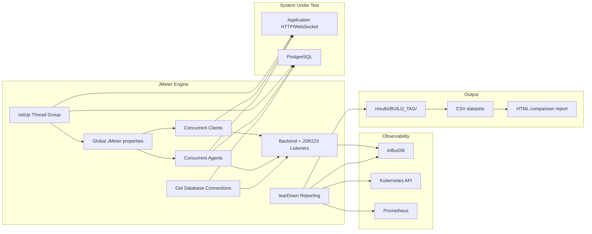

# Architecture

> Why is the JMeter solution structured this way?

This document describes the first-generation architecture: the JMeter lifecycle, Thread Group responsibilities, shared state, custom Groovy logic, metric collection, and teardown reporting.

## Overview

The framework models a stateful customer-support workload. A Client creates work in the application, and an Agent later discovers and processes that work.

The test plan contains five logical layers:

```text
    -> Setup
    -> Concurrent workload
    -> Monitoring
    -> Metrics collection
    -> Teardown reporting
```

The architecture reflects the original constraint: the solution needed to be useful quickly. JMeter therefore became both load generator and orchestration layer.

## High-Level Architecture



## Execution Model

The JMX uses regular Thread Groups that run concurrently:

```text
TestPlan.serialize_threadgroups = false
```

The lifecycle is:

```text
    -> JMeter starts
    -> setUp Thread Group runs once
    -> regular Thread Groups run concurrently
    -> external execution stops the load phase
    -> tearDown Thread Group generates reporting artifacts
    -> test completes
```

The regular Thread Groups are:

| Thread Group | Responsibility |
|---|---|
| `Get Database Connections` | Poll PostgreSQL for connection pressure |
| `Concurrent Clients` | Create conversations through the customer/bot flow |
| `Concurrent Agents` | Authenticate agents, poll assignments, process conversations |

The setup and teardown groups are lifecycle groups:

| Thread Group | Responsibility |
|---|---|
| `setUp Thread Group` | Prepare shared state before load starts |
| `tearDown - reporting` | Build datasets and comparison report artifacts after load ends |

## Setup Layer

Setup runs once before the regular workload.

Its job is to prepare data that every workload group depends on:

```text
    -> read last conversation/contact/agent state
    -> create or prepare agents
    -> add agents to inbox/team
    -> fetch agent tokens
    -> publish shared values
```

The values are published through JMeter global properties because thread variables are local to one thread and cannot cross Thread Group boundaries.

Examples:

```text
conversationId
contactId
agent_token_1
agent_token_2
agent_token_N
```

This is one of the defining architectural choices of Version 1.

## Load Generation Layer

### Concurrent Clients

Client threads represent customers entering the support workflow.

They read test data from CSV and send a short message sequence that causes the application to create or advance a conversation.

```text
    -> read contact row
    -> send initial message
    -> select language
    -> send entry message
    -> conversation becomes assignable
    -> repeat with next contact
```

The Client group is a generator.

The full business entity called "Client" is represented by both the Client Thread Group and later Client-side actions triggered from the Agent workflow.

### Concurrent Agents

Agent threads represent support agents staying active during the test.

```text
    -> load prepared agent data
    -> authenticate
    -> initialize dashboard
    -> open WebSocket
    -> poll assigned conversations
    -> load conversation context
    -> exchange messages
    -> resolve conversation
    -> submit CSAT
    -> return to polling
```

This **group is stateful**.

It uses extractors, controllers, counters, timers, assertions, and JSR223 scripts to maintain the conversation lifecycle.

## Database Monitoring Layer

`Get Database Connections` runs independently from the main workload.

It repeatedly queries PostgreSQL connection state and publishes the value as a metric.

This makes it possible to correlate application latency with database pressure.

The group is intentionally simple:

```text
    -> query connection count
    -> emit metric
    -> wait
    -> repeat
```

## Metrics Layer

The framework collects data from several sources.

| Source | Data |
|---|---|
| JMeter Backend Listener | Standard request metrics sent to InfluxDB |
| JSR223 active-thread listener | Active Client and Agent counts |
| JSR223 Agent utilization listener | Business-level agent activity |
| JSR223 database listener | Database connection metric |
| PostgreSQL | Runtime state and connection pressure |
| Kubernetes | Pod metadata and restart count |
| Prometheus | CPU and memory usage |

The metric design intentionally combines performance, infrastructure, and business signals.

## Reporting Layer

Reporting is executed inside the JMeter `tearDown - reporting` Thread Group.

It performs five main tasks:

```text
1. Collect general test and infrastructure data
2. Export RampUp metrics
3. Export MaxLoad metrics
4. Export WholeRun metrics and aggregation datasets
5. Generate or prepare the HTML comparison report
```

The output is grouped under:

```text
results/<BUILD_TAG>/
    Aggregation/
    Metrics/
    Meta/
    Resources/
    GeneralInfo.csv
    jmeter.log
```

The result folders in this repository are intentionally kept as proof that the pipeline executed and produced structured output.

## Architectural Characteristics

### JMeter as Orchestrator

JMeter owns workload generation, setup, monitoring helpers, state transfer, and teardown reporting. This made the first version fast to build but tightly coupled.

### Global Shared State

Setup values are shared through `props`. This works well enough for a single JMeter controller process but creates implicit dependencies between Thread Groups.

### GUI Plus Groovy

The GUI describes visible workflow structure. Groovy handles logic that JMeter components cannot express cleanly: counters, timestamps, reporting transformations, metric preparation, and dynamic values.

### Embedded Reporting

The teardown reporting pipeline is convenient because it runs automatically after the load phase, but it is also coupled to the JMeter lifecycle. Version 2 moved this responsibility into a standalone service.

## Why It Worked

The architecture succeeded because it solved the actual investigation problem:

- realistic stateful workflow
- concurrent actors
- asynchronous assignment behavior
- HTTP and WebSocket activity
- database and infrastructure correlation
- business metrics
- repeatable reporting output

The design was not ideal for long-term extensibility, but it was operationally valuable and directly informed the second-generation k6 architecture.
