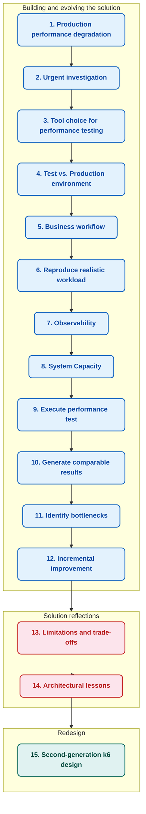

## Project Story

There was no architecture-design phase.

The situation required solving problems one at a time, with each discovery influencing the next implementation decision.

The resulting solution was therefore not designed top-down - it evolved incrementally around the problems that had to be solved.



### 1. Production performance degradation

The product was still in an early stage of development.

Rapid feature development had resulted in architectural compromises and accumulated technical debt.

As workload and production usage increased, these problems contributed to **critical performance degradation affecting the largest customer**.

Performance testing was no longer an optimization exercise; it became part of incident investigation.

### 2. Urgent investigation

The symptoms were not limited to high response times.

Observed production behaviour included:

- resource-usage spikes
- service restarts despite configured CPU/memory limits not being reached
- unexpected usage patterns
- behaviour that could not be reproduced with ordinary functional testing

A direct, in-depth investigation of production was not possible.

At the same time, investigation in test/dev without representative load was unlikely to explain the production behaviour.

A performance test environment therefore became necessary.

### 3. Tool choice for performance testing

Two factors made JMeter the immediate choice:

1. Existing JMeter and Java/Groovy experience.
2. No time to learn a different tool and simultaneously design a new performance-testing architecture.

The goal was not to choose the theoretically best tool.

The goal was to start **producing useful performance evidence immediately**.

> production incident is **NOW**, and a solution to solve it is required **NOW**

### 4. Test vs Production environment

The first major engineering problem was environment parity.

What does it imply?

1. Difference in components configuration

> Solved by rewriting Kubernetes HELM configuration to resemble production

2. Resource limitation

> The objective was not to reproduce production capacity literally, but to preserve the relative workload-to-resource relationship

> Solved by reimagining standard scale configurations in proportion to production one

3. Database seeding

> Synthetic seeding would have required reproducing a large amount of complex domain logic just to prepare data for performance testing, creating a growing maintenance dependency between the test harness and the application

> This would become a **supporting death spiral**

> Solved by copying production database (pg_dump) → anonimization → seeding from real data (pg_restore)

### 5. Business workflow

The second major problem was determining what to load.

There was no sufficiently reliable product documentation describing:

- which conversation channels were actually used
- which actions users performed
- the order of those actions
- the timing between actions
- what state changes each action caused

The only reliable source was production itself:

- production logs
- database state
- support personnel
- meetings / walkthroughs
- observed behaviour

### 6. Reproduce realistic workload

Once the business flow was understood, it was time to follow it with network traffic capture.

Implementing the corresponding HTTP interactions in JMeter was primarily an execution problem constrained by the remaining delivery time.

The results of this implementation can be found here: [`docs/message-flow.md`](./message-flow.md).

### 7. Observability

The third major problem was designing metrics that could explain system behaviour rather than simply record request timings.

I first defined how the collected information needed to be visualized and correlated, then worked backwards into the metrics and collection mechanisms required to support it.

The visualization was done in **Chronograf** (an analogue of the popular **Grafana**).

Such a preference is not functionality-based; this analogue is just more lightweight and visually appealing.

The flow:

```text
Visualization setup → Metrics design → Custom Listeners creation → Query writing → Charts creation
```

The reasoning behind the resulting observability model is documented in [`docs/observability.md`](./observability.md).

### 8. System Capacity

The fourth major problem was the loading profile.

> How many users does each scaling support?
>
> Are the scalings optimized?

The answer to the question is **Capacity Testing** with a gradual increase in users.

The process was done in a loop:

```text
Increase workload
    ↓
Observe application + infrastructure
    ↓
Identify bottleneck
    ↓
Adjust resource distribution / configuration
    ↓
Apply application fix when required
    ↓
Repeat
```

The process was crude by formal performance-engineering standards, but effective for the immediate objective: establish a sufficiently stable capacity baseline before comparing application builds.

Once scaling was optimized enough, it was time for a next step.

### 9. Execute performance test

The objective was to operate close enough to the established capacity boundary to expose performance differences while avoiding a test dominated by saturation.

Therefore, the comparative tests were executed at approximately 80–90% of the established capacity for each scaling configuration.

Client and Agent Thread Group workloads were proportioned so that the available Agents remained fully utilized during the test.

Execution time varied because the initial runs required manual observation of system behaviour, but tests typically lasted one hour or longer.

### 10. Generate comparable results

Without trustworthy absolute acceptance criteria (no SLA), the comparison had to become relative and consistent.

> Current build results must be compared to the previous build results

To present the results, a raw table of response times or visualization was not enough.

Developers often knew their own implementation well, but did not necessarily have enough product context to interpret the performance impact of the complete workflow.

The initial solution was to provide results as a presentation at meetups.

In later stages, the [HTML Comparison Report](https://github.com/Netheria/Performance-Comparison-Reporting) was generated via my custom backend.

The easy-to-understand report design and familiarity with the process made developers confident enough to stop attending meetups.

### 11. Identify bottlenecks

The metrics design and correlation are the main points of performance testing.

Bottlenecks can be identified only through a proper understanding of the collected data.

For example:

| Observation | Possible Interpretation |
|-------------|-------------------------|
| Response time ↑ + CPU ↑ | Infrastructure saturation |
| Response time ↑ + CPU stable | Application logic bottleneck |
| Response time ↑ + Database connections ↑ | Database contention / throttling |
| Active users ↓ + throughput ↓ | Functional regression |
| WebSocket latency ↑ + HTTP stable = | Messaging subsystem degradation |
| Business activity ↓ + HTTP success rate stable = | Functional regression despite healthy APIs |
| Infrastructure healthy + Business metrics abnormal | Application-logic or workflow failure |
| Infrastructure healthy + Business metrics healthy + Response time ↑ | Application-level performance regression |

**These are possible interpretations, not deterministic diagnoses.**

**Correlation does not prove causation; it narrows the investigation.**

### 12. Incremental improvement

The system was immature and unstable:

- heavy background processes without documented logic
- lightweight background processes without logging
- unexpected Memory leaks in the long perspective
- CPU leaks because of infinite loops
- data corruption due to race conditions
- Primary/Foreign Key without proper index
- no partitioning of big tables and iteration through a million entries on each action

This is a small example list of problems that were gradually fixed with each iteration.

After each meaningful iteration or large build, the Capacity testing had to be redone.

### 13. Limitations and trade-offs

The result was a working performance testing solution with clear strengths and equally clear technical debt because of trade-offs.

The resulting solution worked, but it contained deliberate compromises.

Some were caused by delivery constraints.

Others were the result of decisions that were reasonable at the time but became limitations as the project evolved.

#### **Test Plan scalability**

The primary limitation was not JMeter's ability to generate load, but the maintainability of the resulting test plan as business logic and supporting infrastructure grew.

Read in `14. Architectural lessons`.

#### **Custom Load Balancing**

The production system supported multiple conversation channels, so the test harness required its own workload-distribution mechanism.

The public test plan contains only one channel because the original multi-channel implementation contained proprietary logic.

- proportions rule 

> Configurations required to provide a proportion to every conversation channel

- distribution calculation

> Calculated from total number of users
>
> If proportion values are not null or equal to zero, then at least one user will be assigned to the channel route

- create a map of user distribution

> Stored in props
>
> Each user thread knows its designated channel

- condition function routing

> If Controllers were enough for this simple conditioning

#### **Client logic in Agent user Thread Group**

Although separating Client and Agent business roles would look cleaner conceptually, the existing architecture avoided introducing another cross-thread synchronization layer.

The current design therefore favors simpler synchronization over conceptual separation.

#### **Websocket handling**

The current scenario only connects Websocket connection and doesn't handle its logic.

The test established the Websocket connection but did not use the connection as the primary driver for the business workflow.

There were a few reasons for this:

- **event contract was volatile**: the websocket events and messages were frequently changed
- **support cost was too high**
- **delivery pressure dominated**

#### **Stateful orchestration**

The stateful logic was intentionally distributed between GUI structure, controllers, samplers, and scripts because that made the execution visually understandable.

A cleaner solution would've been a few big JSR223 scripts as orchestrators.

But the readability would become worse, and new personnel wouldn't be able to understand the logic.

#### **Libraries instead of scripts**

Some scripts gradually grew too large, so it would be justified to compile them into JARs.

At the cost of slower development, support, and feedback.

#### **Test data is CSV-driven**

The general idea was to have more steerability with the ability to change users’ parameters.

The feature was useful once, during parallel functional testing, but was unnecessary for the long-term performance workload.

This case is a prime example of the `YAGNI` principle.

A data generator would have provided the required variability with less operational overhead.

#### **Infinite loops**

Some workload loops depend on external test termination rather than Thread Group duration settings.

And this was done on purpose.

As the testing was done under manual steering during the starting phase, the termination was done not via a timer, but via manual shutdown.

Once the workload and environment became stable, duration-driven execution was introduced.

#### **Leftover libraries/plugins**

The historical JMeter environment contained additional libraries/plugins that were accumulated over time.

This happened for a few reasons:

- **constant experiments**:

> is this a good library?
>
> does it work in the JMeter env?
>
> does it cover my needs?

Most of the time the answer was to `create my own solution`. 

- **environment evolution**:

Plans to add new and new features that were not done because of time constraints.

The environment evolved experimentally faster than dependency cleanup could keep up.

> For example: Core Web Vitals via Selenium

### 14. Architectural lessons (longread warning)

There exist a lot of development approaches in JMeter.

I'll highlight 3 main ones:

#### 1. **GUI + JSR223 scripts (Groovy/Java)**

I always write large scripts in separate .groovy files and **recommend that you** do the same.

Pros: 

- high-speed development and debugging

> Edit the script, hit Ctrl+S, and re-run the test instantly
>
> No compilation, packaging, or deployment steps

- No Build Pipeline

> Zero need for Maven/Gradle, specific IDE setup, or CI/CD builds to make a change

Cons:

- scalability on large projects

> Checking the GUI, then searching for a file, is bothersome, and IDE false-positive errors are annoying

- teaching implementation to new personnel

> Analysis paralysis all of us have when we see a large project, numerous files, extensive documentation
>
> The GUI, in my personal opinion, is less readable as pure code solution 

- version control nightmare

> JMX files are XML. All scripts are stored as massive, single-line XML-escaped strings
>
> If you follow my recommendation, we skip the large scripts here, but this problem does apply to small scripts too
>
> Git diffs are unreadable. You cannot review changes in a Pull Request, and merge conflicts are practically impossible to resolve

- difficult to Unit Test

> You cannot run these scripts in a standard JUnit/TestNG environment
>
> You are forced to debug via log.info() statements printed to the JMeter console

#### 2. **GUI + .jar's (pure Java)**

Let me bust a common myth: **runtime performance between JSR223 code and code compiled to .jar files is negligible**

> In usage of heavy JSR223 Samplers with "Cache compiled script if available" (which is the default), JMeter compiles the scripts into bytecode

Pros:

- proper software engineering

> Full support for Java/Kotlin/Groovy in IDEs
>
> You get autocomplete, refactoring tools, static code analysis, and immediate syntax error detection before you run the test

- Unit Testing

> You can write JUnit tests for your custom logic (imagine 1000+ code lines)
>
> You can validate complex calculations (e.g., signing payloads, encrypting data, parsing nested JSON) without spinning up JMeter

- custom samplers

> Call via ${__MyCustomSampler(requestData)} without JSR223 Sampler

Cons:

- scalability on large projects

> Nothing changed; Now writing docs is mandatory even for a solo developer

- teaching implementation to new personnel

> Nothing changed; Best he knows proper Java and OOP because now it is not running on the Groovy engine

- version control nightmare

> For JMX, nothing changed; But now we're managing dependencies!
>
> If your custom code uses a specific library, you must bundle it into a fat/uber JAR or manually place it in `lib/`, potentially causing version conflicts with JMeter's internal dependencies

- slow feedback loop

> Edit code → mvn clean package → copy JAR to jmeter/lib/ext/ → Restart JMeter → Run
> 
> Very "fast", right? 

- debugging

> Debugging inside a JAR requires attaching a remote debugger to the JMeter JVM
>
> You lose the ability to quickly inject `log.info()` and re-run without rebuilding, so rely on error handling inside the code

#### 3. **JMeter DSL via Java API**

A way to write [**test plan-as-code**](https://abstracta.github.io/jmeter-java-dsl/) in pure Java.

**Note: the `jmx2dsl` tool can convert existing .jmx files to Java code!**

Pros:

- standard code: full power of Java, Git, and IDE-friendly

> Plain, good Java code with full support of all IDE features

- no GUI clunkiness and no JAR hell

> You don't need to open the JMeter GUI and navigate a huge tree of samplers
> 
> You don't need to manually compile and deploy custom .jar files

- "Shift-Left" and CI/CD friendly

> **MUCH** easier CI/CD integration without supporting JMeter in the image

Cons:

- requires Java knowledge

> Manual QAs and Selenium/Playwright-only QAs are out

- not a 1:1 feature match

> It doesn't (and may never) support 100% of JMeter's vast array of components and plugins
> 
> This is not really a big problem but will require development skills

- no GUI

> This is a plain code development domain, and in concurrent code, IDE tools may not provide insights into what, when, and how the code works
> 
> The documentation is even more mandatory than before

#### My choice

Of course, from the story, it is easy to identify that I’ve chosen the **GUI + JSR223 scripts** option.

**The rapid development and immediate results were a priority**.

Moreover, when the development started, the JMeter DSL was not widely known and on initial stages of development.

Currently, the **JMeter DSL would be the best choice** if it is not a one-off Test Plan.

### 15. Second-generation k6 design

Because of corporate reasons to transition everything to one language - TS/JS - the [framework had to be rewritten in k6](https://github.com/Netheria/k6-Performance-Testing-Framework).

The migration to k6 was not simply a translation of JMeter syntax into JavaScript.

It was an opportunity to redesign the architecture around the lessons learned from the first-generation implementation.
