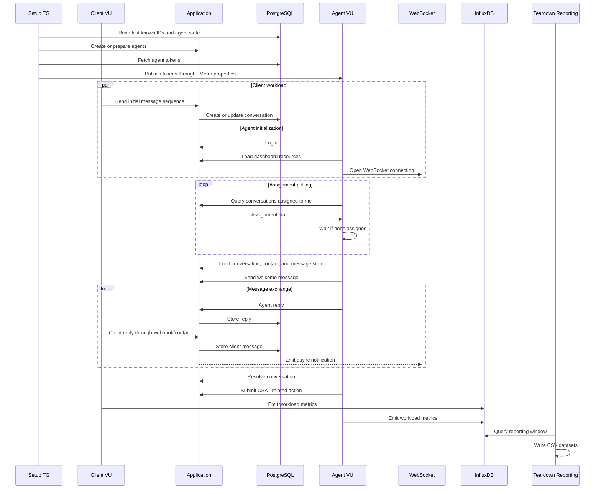

# Message Flow

> How does one customer-support interaction move through the JMeter workload?

This document follows the workload from setup through Client message creation, Agent assignment, conversation processing, resolution, CSAT, and reporting.

## Why Flow Matters

This test is not a collection of unrelated HTTP requests.

The meaningful unit is a business workflow:

```text
    -> user action
    -> application state changes
    -> another actor observes that state
    -> another action becomes possible
    -> workflow continues
```

That is why Client and Agent Thread Groups must run concurrently.

## Workflow Overview



## Stage 1: Setup

Before concurrent load begins, the setup group prepares shared values:

```text
    -> set test start time
    -> read last conversation ID
    -> read last contact ID
    -> read last agent data
    -> create or prepare agents
    -> attach agents to inbox/team
    -> fetch agent tokens
    -> publish properties
```

This prevents the main workload from measuring environment bootstrap as if it were user traffic.

## Stage 2: Client Creates Work

Client threads read contact data from CSV and send the entry sequence.

```text
    -> initial message
    -> language menu response
    -> entry message
    -> conversation becomes active or assignable
```

The important result is not a single HTTP response.

The important result is an application state transition: an Agent can now discover the conversation.

## Stage 3: Agent Authentication

Each Agent initializes like a real dashboard user:

```text
    -> /app/login
    -> /auth/sign_in
    -> extract Bearer token
    -> extract pubsub token
    -> open main application page
```

Authentication is a prerequisite for dashboard loading, conversation polling, messaging, and WebSocket activity.

## Stage 4: Dashboard Initialization

After login, the Agent loads dashboard context:

- labels;
- inboxes;
- teams;
- unread notification count;
- current conversations;
- agent data;
- account configuration;
- notification settings;
- custom filters;
- profile availability.

The Agent also opens a WebSocket connection.

The test plan opens and exercises the persistent channel as part of a realistic dashboard session.

## Stage 5: Assignment Polling

Agents do not receive a conversation instantly. They poll until the application assigns work.

```text
    -> query assigned conversations
    -> if none assigned: wait and poll again
    -> if assigned: extract conversation and contact identifiers
```

This waiting is part of the performance signal.

A system can have fast endpoints while still assigning work slowly under load.

## Stage 6: Load Conversation State

When an assigned conversation appears, the Agent loads the context needed to process it:

- conversation details;
- contact details;
- conversation history;
- labels;
- inbox information;
- custom attributes;
- dialog labels;
- last-seen state.

The workload intentionally avoids jumping directly from "conversation exists" to "send reply".

A real user opens and reconstructs context first.

## Stage 7: Message Exchange

The scenario performs multiple message rounds.

Conceptually:

```text
    -> Agent sends message
    -> application stores message
    -> Client response is sent through the contact/webhook path
    -> application stores client message
    -> Agent reads updated state
    -> repeat
```

Some Client-side actions are executed from inside the Agent Thread Group after assignment because that was the simplest way to keep one conversation lifecycle coordinated in JMeter **without introducing another synchronization layer**.

## Stage 8: Resolution and CSAT

After the message exchange finishes, the Agent resolves the conversation:

```text
    -> update last seen
    -> toggle status to resolved
    -> verify resolved state
    -> submit CSAT-related action
```

Assertions validate business state, not only HTTP success.

## Stage 9: Repeat

Agents return to polling. Clients continue creating conversations from the CSV data source.

The load phase continues until the external execution environment stops the test.

```text
    -> Client creates conversation
    -> Agent discovers it
    -> Agent processes it
    -> conversation is resolved
    -> Agent returns to polling
    -> Client creates another conversation
```

## Timing and Think Time

Timers are distributed throughout the flow.

This prevents the workload from becoming a machine-speed API loop and better represents pauses between user actions:

```text
    -> read
    -> think
    -> reply
    -> wait
    -> next action
```

The exact values can be tuned through test properties and the JMX.

## Failure Handling

The JMX uses assertions for:

- expected HTTP status codes;
- expected response content;
- expected conversation state;
- valid existing-resource outcomes;
- successful state transitions.

That distinction matters in stateful performance testing.

A request can return successfully while the business workflow is still wrong.

## Metrics During the Flow

The workflow produces multiple categories of evidence:

| Point in flow | Metric value |
|---|---|
| HTTP samplers | response time, throughput, status, errors |
| Agent activity | workload utilization |
| Database monitor | PostgreSQL connection pressure |
| WebSocket activity | persistent dashboard channel participation |
| Teardown reporting | period-based CSV datasets |
| Kubernetes/Prometheus | infrastructure context |

The final result is not just a JMeter `.jtl` file. It is a structured evidence package for comparison and investigation.
