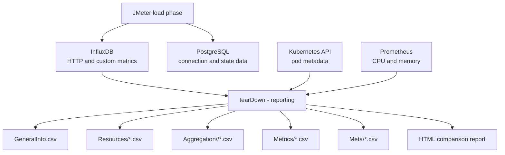

# Reporting

> How does the JMeter v1 framework transform raw metrics into comparison-ready datasets?

Version 1 performs reporting inside the JMeter lifecycle. After the concurrent workload stops, the `tearDown - reporting` Thread Group runs Groovy scripts that collect metadata, query metrics, write CSV datasets, and render or prepare an HTML comparison report.

## Reporting Workflow



The reporting phase is synchronous from JMeter's point of view. The test execution is not fully complete until teardown scripts finish.

## Teardown Steps

The teardown group contains five reporting steps.

| Step | Purpose |
|---|---|
| General info and resources | Collect test timing, configuration, Kubernetes pod data, and Prometheus resource metrics |
| RampUp metrics to CSV | Export metrics for the ramp-up period |
| MaxLoad metrics to CSV | Export metrics for the steady max-load period |
| Run metrics to CSV | Export WholeRun metrics and period-based aggregation datasets |
| Performance Comparison Report | Read generated CSV data and render comparison output |

The Groovy scripts live under `flows/performance/conversationload_scripts/`.

## Time Windows

The report separates one execution into meaningful periods:

| Period | Meaning |
|---|---|
| `RampUp` | From test start until the configured maximum-load point |
| `MaxLoad` | From maximum-load point until test finish |
| `WholeRun` | Complete execution window |

This separation matters because ramp-up behavior and steady-state behavior answer different questions.

## Query-Driven Collection

Metric extraction is driven by `flows/performance/query_list.xml`.

The reporting scripts substitute runtime values into query templates:

- test start time;
- max-load time;
- test end time;
- aggregation interval;
- build tag;
- metric category.

The result is a set of structured CSV files rather than one raw JMeter output file.

## Result Structure

Each run writes data under `results/<BUILD_TAG>/`.

```text
results/<BUILD_TAG>/
    GeneralInfo.csv
    Resources/
        <component>_CPU.csv
        <component>_Memory.csv
    Aggregation/
        RampUp/
        MaxLoad/
        WholeRun/
    Metrics/
    Meta/
    testapp.performance.conversationload.stdout.csv
    jmeter.log
```

### GeneralInfo

`GeneralInfo.csv` contains execution context:

- component names;
- images;
- CPU and memory limits;
- restart counts;
- test start, max-load, and finish timestamps;
- workload configuration.

### Resources

`Resources/*.csv` contains infrastructure time series collected from Prometheus and aligned with Kubernetes pod metadata.

### Aggregation

`Aggregation/<period>/*.csv` contains summarized performance data for RampUp, MaxLoad, and WholeRun. These files are designed for quick comparison between periods and builds.

### Metrics

`Metrics/*.csv` contains whole-run time-series groups such as throughput, active threads, errors, database-related metrics, and workflow actions.

### Meta

`Meta/*.csv` contains supporting business or workload metrics, such as Agent activity and database connection samples.

## Proof Artifacts

This repository keeps two result folders:

- `results/test2`
- `results/test3`

They are included intentionally as proof that the JMeter framework executed and generated the expected reporting structure.

These folders are not meant to be perfect benchmark evidence for a public system. They are anonymized portfolio artifacts showing that the framework produced real output: raw samples, metadata, resource data, metric datasets, and aggregation files.

## Difference from Version 2

In the k6 version, reporting became a standalone service. That is a cleaner architecture because load generation and report generation can evolve independently.

In this JMeter version, reporting is embedded in teardown. That was the right trade-off for the first version because it kept execution and reporting inside one operational workflow.

The difference is one of the central lessons carried from Version 1 into Version 2.
