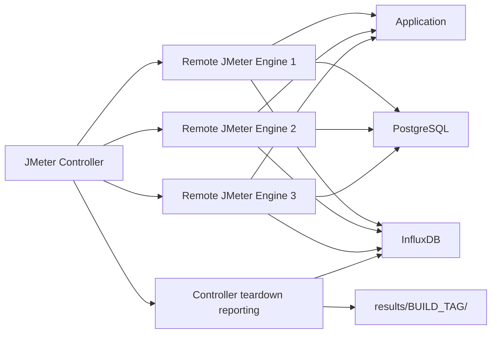

# Distributed Execution

> How can the JMeter framework be scaled across multiple load generators?

Version 1 relies on JMeter's native distributed execution model: one controller starts the test and one or more remote JMeter engines generate load.

This differs from Version 2, where k6 workers coordinate through Redis and a standalone reporting service.

**Because JMeter does support Master-Slave execution model and k6 does not.**

## Architecture



## Prerequisites

Every remote engine must have:

- the same JMeter version
- the same plugins and libraries
- the same test plan and external script files
- compatible Java version
- network access to the application, database, and InfluxDB
- matching property values or property files

The controller must be able to reach every remote engine through JMeter RMI.

## Remote Engine Startup

On each worker:

```bash
./bin/jmeter-server
```

or on Windows:

```bat
bin\jmeter-server.bat
```

The worker's `jmeter.properties` must allow the controller to connect.

Typical settings include `remote_hosts` on the controller and RMI-related properties on both sides.

## Controller Execution

From the controller:

```bash
./bin/jmeter.sh -n -r -f \
  -t "flows/performance/testapp.performance.conversationload.jmx" \
  -l "results/<BUILD_TAG>/testapp.performance.conversationload.stdout.csv" \
  -p "bin/test.properties" \
  -JBuildTag=<BUILD_TAG>
```

Use `-R` to target a specific list of remote engines:

```bash
./bin/jmeter.sh -n -R <worker-1>,<worker-2>,<worker-3> \
  -t "flows/performance/testapp.performance.conversationload.jmx" \
  -l "results/<BUILD_TAG>/testapp.performance.conversationload.stdout.csv"
```

## State and Coordination Notes

JMeter distributed mode starts the same test plan on remote engines.

That makes load scaling possible, but it also means shared in-memory JMeter properties are not a general distributed coordination mechanism across machines.

For this v1 framework, distributed execution must be planned carefully:

- setup data must be available to the workers that need it
- CSV data must be distributed consistently
- worker clocks should be synchronized
- all workers should write metrics to the same InfluxDB
- result interpretation should account for multiple engines contributing samples

This is one of the reasons Version 2 introduced explicit Redis-based coordination.

Version 1, with clever use of CSV data and clocks, does make each worker self-contained.

## Reporting Notes

The v1 teardown reporting flow is controller-centered.

The controller queries InfluxDB, Kubernetes, and Prometheus after the distributed load phase and writes the result datasets.

All workers should therefore push metrics into the same InfluxDB database and use consistent build tags.

## Difference from k6 Version 2

JMeter distributed mode distributes execution, but coordination remains mostly implicit and tied to the JMeter controller/remote-engine model.

The k6 version redesigned this area:

- workers coordinate through Redis
- test boundaries are stored explicitly
- monitoring is single-sender to avoid duplicate metric streams
- reporting is triggered by a standalone service

The JMeter approach was practical for Version 1.

The k6 approach is cleaner for long-term distributed framework evolution.

---

**See Also:**
- [Local / Server Execution](./local-or-server-execution.md)
- [Continuous Integration Execution](./continuous-integration-execution.md)
- [Containerized Deployment](containerized-deployment.md)
